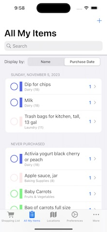

#  About "ShoppingList17"

ShoppingList17 is a simple iOS app to manage a shopping list that you can take to the grocery store with you, moving items off the list as you pick them up.  It persists data with SwiftData (optionally, synched across your personal devices using iCloud if you configure the app correctly), and is written entirely with Swift and SwiftUI.  This project was posted using Xcode 15 and requires iOS 17.0 or later.

* In ShoppingList17, i will be exercising new iOS17-specific features, not the least of which is incorporation of the SwiftData and Observation frameworks.

This is the fifth iteration of my original ShoppingList project and will yet again be my learning environment for new features in what most people call "SwiftUI 5," the version of SwiftUI released at WWDC in June, 2023.  I will try to use newer features available in iOS 17 whenever I can.

* An [earlier version of this project](https://github.com/delawaremathguy/ShoppingList16) is available that works with XCode 14/iOS 16.  If you have not yet made the move to XCode 15/iOS 17, you should use this (or another, earlier) version of the project instead.  

* An [earlier version of this project](https://github.com/delawaremathguy/ShoppingList15) is available that works with XCode 13.5/iOS 15.  If you have not yet made the move to XCode 14/iOS 16, you should use this earlier project instead.  

  - Of note: ShoppingList15 has three branches: the branch most similar to the code of this project is in the `master` branch; the branch `MVVM` has a more clearly-defined MVVM architecture that does not use `@FetchRequest`; and the `MVVM-2` branch is built on top of `MVVM` with a significant twist.

* An [even earlier version of this project](https://github.com/delawaremathguy/ShoppingList14) is available that works with XCode 12.5/iOS 14.5.

* And [the original version of this project](https://github.com/delawaremathguy/ShoppingList) is available that was posted with XCode 11.7/iOS 13.7. 

Feel free to use this as is, to develop further, to completely ignore, or even just to inspect and then send me a note or Open an Issue to tell me I am doing this all wrong.  

## Official Release of 8 November, 2023

### For latest update of 07 December, 2023 ... keep reading below.

### What's Changed Since SL16?

* Use of Core Data in previous incarnations of this project has been replaced with SwiftData (the SwiftData models are *essentially* updated Core Data entities of previous versions).  There is no PersistentStore object.  
* `@FetchRequest`s have been replaced with `@Query`s.
* Use of `ObservableObject`s has been replaced with the `@Observation` framework.
* I now use an extension on the SwiftData modelContext to support basic create and delete operations on model objects.
* the `visitationOrder` property of a Core Data Location has been renamed to `position` in the corresponding SwiftData Location model.
* the `dateLastPurchased` property of a Core Data Item has been renamed to `lastPurchased` in the corresponding SwiftData Item model.
* the `id` properties of Core Data Items and Locations have been renamed to `referenceID` in the corresponding SwiftData models, since models in SwiftData are already Identifiable and you can not have your own `id` property.
* Although I did briefly test the possibility of using an existing Core Data store from iOS16, that appears to be either not possible or at least fairly complicated.  Given the level of this project, I think doing anything in this direction is really beyond the scope of what we have here.  However, if you have been using ShoppingList already and don't want to lose existing data, SL16 added the capability to archive your data to the Files App; and now SL17 can import that data from the Files App.
* What was previously called the "Purchased List," which included only "items not on the shopping list," has been changed to be a listing of **all** your items, whether on the shopping list or not.  This view is now the "All My Items" list.  Items that are on the shopping list will appear with a cart icon on the right side.  This way, there will be no confusion in maybe adding something new to the shopping list that's already on the list (but not displayed).
* The previous notion of sectioning out what is now the "All My Items" list into those recently purchased and then everything else has been re-envisioned.  The new UI offers a segmented control above the list with options to display either by name or by (most recent) purchase date.  The notion of a "history mark" preference has been removed, and the previous sectioning controls that were attached to the first section's header have been removed.
* The "Shopping List" tab UI has also been changed to have a segmented control above the list with options to display either by name or by location, and the previous sectioning controls that were attached to the first section's header have been removed.

### Minor adjustments since the pre-release of 2 November ...

* (*02Nov*) NavigationStack and NavigationSplitView and .navigationDestination were initially mis-behaving on iPad, but I think these have been fixed (tested on iPhone and iPad devices OK).
* (*06Nov*) Tapping the leading touch area of an item in the AllMyItems list simply toggles the "onList" status of the item.  If toggling from "on" to "off" list, the item will now *not be marked as having been purchased*.  
* (*06Nov*) I have added code to unify any unknown locations that arise in the app due to iCloud latency and connection issues across devices.  ~~Early returns are promising, at least ... but not yet a done deal (!)~~
* (*07Nov*) Still cleaning up yesterday's subtlety of handling multiple unknown locations introduced by cloud latency when installing on a second or third device on your Apple ID.
* (*08Nov*) I think I'm done with the cloud latency/multiple device issue.  We're now officially released.  Please open an issue of put up a PR if you find anything amiss.

### Minor adjustments since the official release of 8 November

* (*13Nov*) Added some buttons to the ContentUnavailableView in the ShoppingListView to add a new item to the shopping list directly, or to navigate over to the AllMyItemsView to pick items there.
* (*13Nov*) Location.append(:Item) now renamed to Location.addToItems(:Item).  a reciprocal Location.removeFromItems(:Item) has been added, and the relationship Location.itemsOptional is now marked `fileprivate`.
* (*17Nov*) Fixed issue with multi-section list presentations in ShoppingListView and AllMyItemsView not properly persisting display choice in UserDefaults by adding an onChange() modifier to each view.
* (*27Nov*) Added a badge to the shopping list icon (in a TabView) or shopping list label (in a NavSplitView sidebar) to show the count of items on the shopping list.
* (*07Dec*) "Fixed" a crash when navigating from LocationsView to edit a Location in ModifyExistingLocationView?  (It started crashing in the simulator, but was working fine on device).)

## General App Overview

The main screen is a TabView (in a compact size class, such as in portrait orientation on an iPhone) or Split View (in a regular size class, such as landscape orientation on an iPad).

* Initially presented in the first tab is a list of the items on your shopping list, sorted either numerically or by location in which they are found.

   

* Tapping on the circular button on the leading edge of an item's display marks an item as purchased and removes it from the shopping list.  Tapping elsewhere on any row allows you to edit an Item, while tapping the "+" button in the navigation bar allows you to add a new item.  Long pressing on a row reveals a context menu that lets you mark an item as purchased, toggle between the item being available and not available (*items not available will have a strike-through, italic presentation on screen*), or even to delete the item.

 

* A (searchable) list of ALL items you have ever created appears in the second tab view, and is displayed either in one section alphabetically, or in multiple sections according to purchase date (or "never purchased") starting from the most recent.  Items currently on the shopping list are indicated by a green "cart" icon.

   

* Again, tapping on the circular button on the leading edge of an item's display toggles whether the item appears on the shopping list (but *does not mark the item as having been purchased* if the item's status changes from on the list to not on the list).  Tapping elsewhere on any row allows you to edit an Item, while tapping the "+" button in the navigation bar allows you to add a new item.  Long pressing on a row reveals a context menu to perform some quick actions as described above.

* A list of "locations" in a store is displayed in the third tab view. Locations are simply identifiable areas of a store, such as "Dairy," "Fruits & Vegetables," "Deli," "Aisle 12," and so on where items can be found.  

 

* Tapping on any row allows you to edit an existing Location (tapping the "+" button in the navigation bar allows you to create a new Location). 

 

* You can change the order of locations in the list simply by dragging, and this determines the order in which the shopping list is presented, allowing you to traverse the grocery store for efficient shopping.
 
* The fourth tab is for user Preferences, which contains a single on-off toggle of "whether the in-store timer will be paused if the app goes into the background," e.g., keep the timer running while you're on the phone?

 

* The fifth tab is a "More..." tab that contains 

  - an in-store timer to track how long it takes you to complete shopping (not shown), 
  - buttons to export or import shopping list archives, 
  - and (for development purposes only) a button so you can load sample data so you can try out the app when running on the simulator.

 

Other notes for Operation:

* The shopping list has a "share" icon in the navigation bar that will bring up a share sheet, so that you can send off a copy of your list by email, text, or social media.

* The list of locations always shows a special location to mean that "I don't really know where this item is yet, but I'll figure it out at the store." This **Unknown Location** always appears last in the list of Locations, and is the default location to which to associate a new item. (The unknown location will come at the end of the shopping list.)

* What happens to Items at a Location when the Location is deleted?  The Items are not deleted, but are moved to the Unknown Location.

### App Architecture Notes

The SwiftData container is organized into models named `Item` and `Location`.  A single Location is associated with (has a `@Relationship` to) many Items.

This app represents a basic, @Query-driven SwiftUI app structure, with very few hints of MVVM scattered about.  in particular, the `ModelContext` class has been extended with methods to support adding model objects, to help out with lookups of objects, and to find/manage the unknown location (identified by its `position`).

## What Can You do with this Project?

If you would like to test out this app and decide if it might be of interest to you:

* Run it on the simulator, go straight to the More... tab on startup and tap the "Load Sample Data" button.  Now you can play with the app.

If you plan to install and use this app on a single device without using iCloud:

* You should first delete the ShoppingList.entitlements file (this is what connects iCloud to the app). After installing on a device, the app will start with an empty shopping list and a location list having only the special "Unknown Location"; from there you can create your own shopping items and locations associated with those items.  (*Suggestion: add Locations before adding Items!*) 

If you plan to install and use this app on a device and either have it simply backup data in the cloud, or share its data through the cloud with other devices on the same Apple ID:

* You will need to update your bundle identifier, your iCloud container identifier, and establish your correct app signing credentials.  
  
* WARNING: The SwiftData use of iCloud in SL17 is incompatible with the previous Core Data use of iCloud in SL16.  If you have been using SL16 with the cloud, you should first archive any data  you want to keep from SL16 to the Files app; delete the app from all your devices; open your iCloud dashboard and clear out the container you've been using; then finally install and run SL17 on your device(s).  Existing data can now be imported to populate the SwiftData store (on just **one** of your devices; any other will naturally pick up the data through the cloud).

## License

* The app icon was created by Wes Breazell from [the Noun Project](https://thenounproject.com). 
* The extension I use on Bundle to load JSON files is due to Paul Hudson (@twostraws, [hackingwithswift.com](https://hackingwithswift.com)) 
* a view modifier named `navigationAppearance()` comes straight from YouTube content provider [Stewart Lynch](https://createchsol.com) and i hope you'll consider subscribing to his excellent YouTube channel and possibly even "buying him a Ko-Fi".

Otherwise, just about all of the code is original or widely available, and it's yours if you want it -- please see LICENSE for the usual details and disclaimers.

